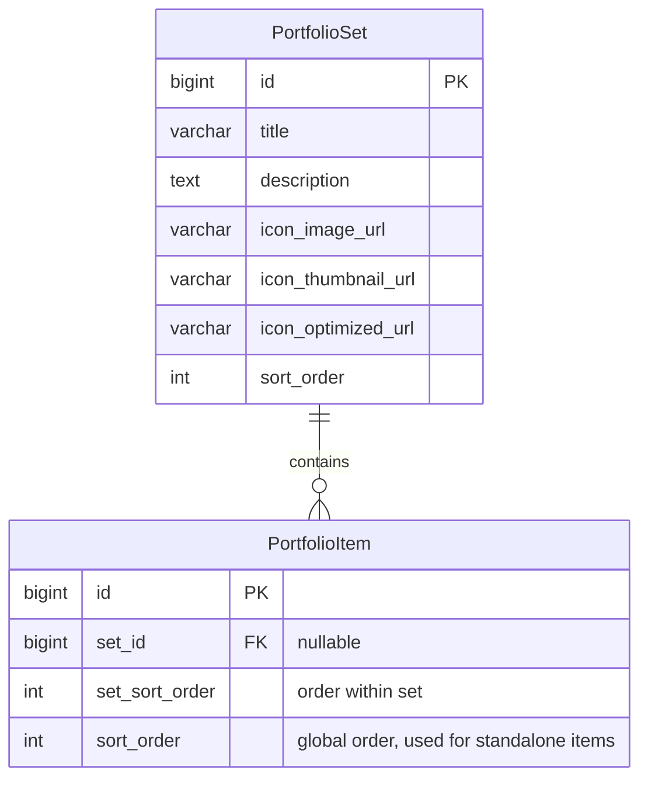
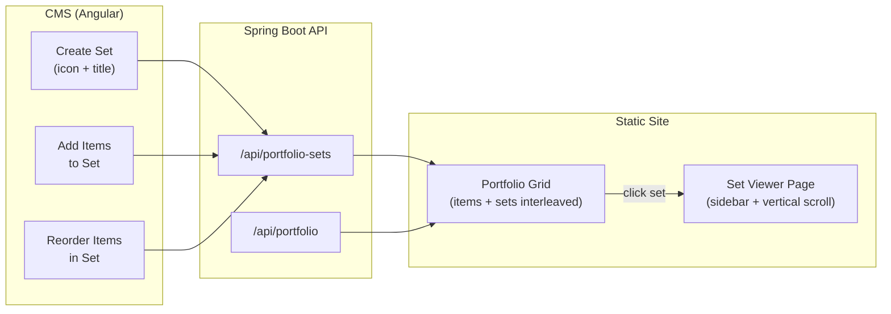

# Portfolio Sets Feature

## Data Model

Introduce a new `portfolio_set` table. Portfolio items gain an optional foreign key to a set and a `set_sort_order` column for ordering within the set. Sets themselves have a `sort_order` that participates in the same ordering space as standalone portfolio items.

### Database Migration

- **New file**: `src/main/resources/db/migration/V3__add_portfolio_sets.sql`
  - Create `portfolio_set` table (id, title, description, icon_image_url, icon_thumbnail_url, icon_optimized_url, sort_order)
  - Add `set_id` (nullable FK) and `set_sort_order` columns to `portfolio_item`
  - Add index on `portfolio_item.set_id`

## Backend Changes

### New Entity and Repository

- **New file**: [src/main/java/org/tanzu/thstudio/portfolio/PortfolioSet.java](src/main/java/org/tanzu/thstudio/portfolio/PortfolioSet.java) -- JPA entity with `@OneToMany` relationship to `PortfolioItem`
- **New file**: [src/main/java/org/tanzu/thstudio/portfolio/PortfolioSetRepository.java](src/main/java/org/tanzu/thstudio/portfolio/PortfolioSetRepository.java) -- Spring Data JPA repository

### Updated Entity

- **Edit**: [src/main/java/org/tanzu/thstudio/portfolio/PortfolioItem.java](src/main/java/org/tanzu/thstudio/portfolio/PortfolioItem.java) -- Add `setId` (Long, nullable) and `setSortOrder` (Integer) fields with getters/setters

### Updated Repository

- **Edit**: [src/main/java/org/tanzu/thstudio/portfolio/PortfolioItemRepository.java](src/main/java/org/tanzu/thstudio/portfolio/PortfolioItemRepository.java) -- Add `findBySetIdOrderBySetSortOrderAsc(Long setId)` and `findBySetIdIsNullOrderBySortOrderAsc()` query methods

### New Controller

- **New file**: [src/main/java/org/tanzu/thstudio/portfolio/PortfolioSetController.java](src/main/java/org/tanzu/thstudio/portfolio/PortfolioSetController.java) -- REST controller at `/api/portfolio-sets` with:
  - `GET /` -- list all sets (with item counts)
  - `GET /{id}` -- get set with its items
  - `POST /` -- create set (multipart: icon image + title + description)
  - `PUT /{id}` -- update set metadata
  - `PUT /{id}/icon` -- replace icon image
  - `DELETE /{id}` -- delete set (ungroups items or deletes them -- ungroups to keep items)
  - `PUT /{id}/items` -- set the ordered list of item IDs belonging to this set
  - `PUT /reorder` -- reorder sets in the global sort order

### Updated Controller

- **Edit**: [src/main/java/org/tanzu/thstudio/portfolio/PortfolioItemController.java](src/main/java/org/tanzu/thstudio/portfolio/PortfolioItemController.java) -- Update `create()` to accept optional `setId` param; update `reorder()` to handle the interleaved sort ordering

## Frontend (CMS) Changes

### Models

- **Edit**: [src/main/frontend/src/app/portfolio/portfolio.models.ts](src/main/frontend/src/app/portfolio/portfolio.models.ts) -- Add `PortfolioSet` interface and add `setId` / `setSortOrder` to `PortfolioItem`

### Service

- **Edit**: [src/main/frontend/src/app/portfolio/portfolio.service.ts](src/main/frontend/src/app/portfolio/portfolio.service.ts) -- Add set CRUD methods: `listSets()`, `createSet()`, `updateSet()`, `deleteSet()`, `updateSetIcon()`, `setItems()`

### Portfolio List (CMS Page)

- **Edit**: [src/main/frontend/src/app/portfolio/portfolio-list/portfolio-list.ts](src/main/frontend/src/app/portfolio/portfolio-list/portfolio-list.ts) and [portfolio-list.html](src/main/frontend/src/app/portfolio/portfolio-list/portfolio-list.html) -- Add:
  - "New Set" button alongside "New Item"
  - Sets displayed as expandable cards in the grid, interleaved with standalone items by sort order
  - Each set card shows icon, title, item count badge, and can be expanded to show/manage its items
  - Ability to add existing standalone items to a set, remove items from a set, and reorder items within a set

### New Set Dialog

- **New file**: `src/main/frontend/src/app/portfolio/portfolio-set-dialog/portfolio-set-dialog.ts` -- Material dialog for creating/editing a set (icon image upload, title, description)

## Static Site Changes

### Site Generator

- **Edit**: [src/main/java/org/tanzu/thstudio/publish/SiteGeneratorService.java](src/main/java/org/tanzu/thstudio/publish/SiteGeneratorService.java):
  - Update `generate()` to fetch portfolio sets and generate a set viewer page for each set
  - Update `renderPortfolio()` to pass both standalone items and sets, interleaved by sort order
  - Add `renderPortfolioSet()` method to render each set's viewer page
  - Add set viewer CSS to `generateStyleCss()`

### Portfolio Template

- **Edit**: [src/main/resources/site-templates/portfolio.html](src/main/resources/site-templates/portfolio.html) -- Render an interleaved grid where:
  - Standalone items render as before (thumbnail + lightbox)
  - Sets render as cards with the set's icon image, title, and a small item count badge; clicking navigates to `/portfolio/sets/{id}/`

### New Set Viewer Template

- **New file**: `src/main/resources/site-templates/portfolio-set.html` -- A dedicated page for browsing a set, modeled after the PDF viewer in the screenshot:
  - **Left sidebar**: Scrollable column of numbered thumbnail previews for each item in the set; clicking a thumbnail scrolls the main content to that item
  - **Main content area**: All items stacked vertically, each displayed as a full-width image with title/description below
  - Active thumbnail highlighted in the sidebar based on scroll position (using `IntersectionObserver`)
  - Responsive: sidebar collapses to a horizontal strip on mobile

### New Set Viewer JavaScript

- **New file**: `src/main/resources/site-assets/set-viewer.js` -- Vanilla JS handling:
  - Scroll-spy: uses `IntersectionObserver` to highlight the sidebar thumbnail matching the currently visible item
  - Thumbnail click: smooth-scrolls the main content to the corresponding item
  - Keyboard navigation: Up/Down arrow keys to jump between items

### CSS Additions (in `generateStyleCss()`)

- Set badge overlay on portfolio grid cards
- Set viewer layout: sidebar + main content area, responsive breakpoints
- Active thumbnail highlight styling
- Smooth scroll behavior

## Flow Diagram

